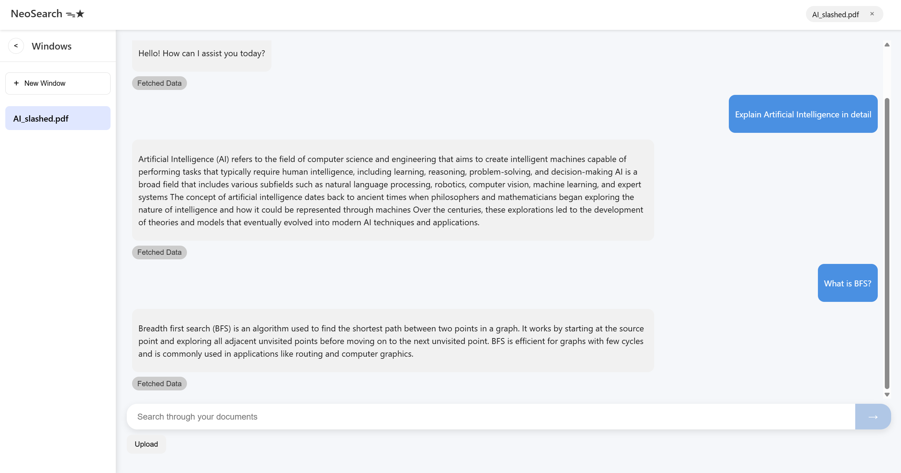
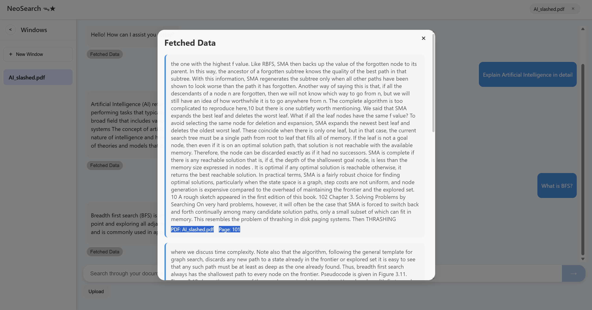

# NeoSearch

NeoSearch is an AI-powered semantic document search engine that offers lightning-fast, privacy-focused querying of large text documents. It allows users to upload documents, generate embeddings offline, and retrieve answers in real-time, all within a local environment.

Powered by FAISS and the all-mpnet-base-v2 model, NeoSearch blends keyword relevance (BM25) with semantic understanding for highly accurate results. The application features a modern React frontend and a FastAPI backend for optimal performance and responsiveness.

## Features

* **Local AI Document Search**: Fully local, offline-first search engine with no external API calls for privacy.
* **Semantic + Keyword Ranking**: Combines FAISS vector search with BM25-based re-ranking for hybrid accuracy.
* **Real-Time Querying**: Get answers from large documents in under a second.
* **Persistent Embeddings**: Avoid re-indexing on repeated document uploads.
* **AI-Powered Responses**: Utilizes Qwen2-1.5B-Instruct to generate tailored responses based on retrieved document chunks and user queries.
* **Single Chat UI**: Intuitive React interface with "Fetched data" buttons below each response that display source documents with PDF names and page numbers.
* **Asynchronous Processing**: Embedding and chunking tasks run in parallel using asyncio and ProcessPoolExecutor.
* **FastAPI Backend**: Clean, efficient, and async-capable backend for rapid query processing.




## Tech Stack

* **Frontend**: React.js, Axios
* **Backend**: FastAPI, Uvicorn, PostgreSQL, FAISS
* **AI Models**: 
  * `all-mpnet-base-v2` (Sentence Transformers for embeddings)
  * `Qwen2-1.5B-Instruct` (Response generation)
* **Search Engine**: FAISS (Semantic) + BM25 (Keyword)
* **Parallelism**: `asyncio`, `ProcessPoolExecutor`
* **Vector Storage**: FAISS (in-memory or persisted locally as .npy files)
* **Database**: PostgreSQL (storing chat windows, documents, and text chunks)
* **Text Processing**: Pymupdf, NLTK

## Setup Instructions

1. Clone the Repository

```bash
git clone https://github.com/Mayankrai449/AI_Search_Engine.git
cd AI_Search_Engine
```

2. Frontend Setup

```bash
cd frontend
npm install
```

3. Backend Setup

```bash
cd ../backend
pip install -r requirements.txt
```

4. Run the Application

* **Start Backend**:

```bash
cd /app
uvicorn main:app --reload
```

* **Start Frontend**:

```bash
cd ../frontend
npm start
```

5. Access NeoSearch

Open your browser at http://localhost:3000 to begin querying your documents!

## Usage

1. **Upload Document**: Add one or more plain-text or PDF files.
2. **Query in Chat Window**: Ask your questions using natural language.
3. **View Source Context**: Click "Fetched data" below responses to see the exact document chunks, source PDF names, and page numbers used to generate the answer.
4. **Re-query Without Reprocessing**: Upload once, reuse embeddings.

Thank you for using NeoSearch! Feel free to reach out with any questions or issues — **mayankraivns@gmail.com**. Happy querying! 🧠📄